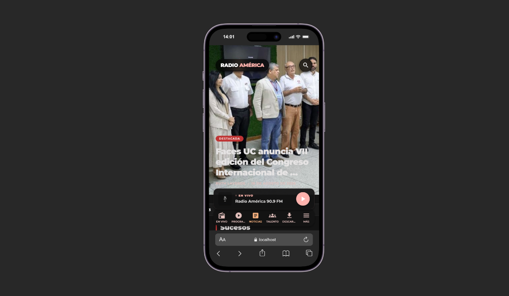
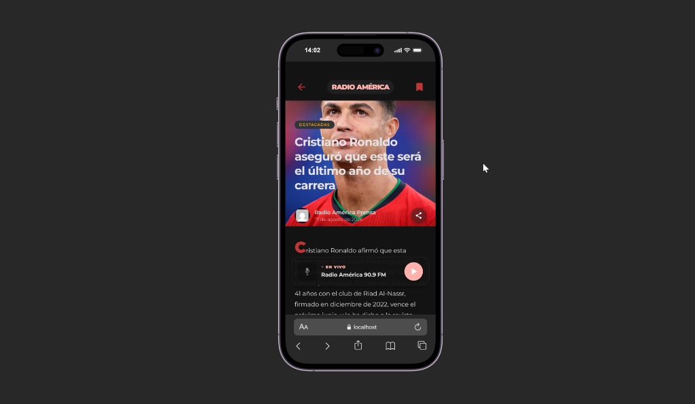
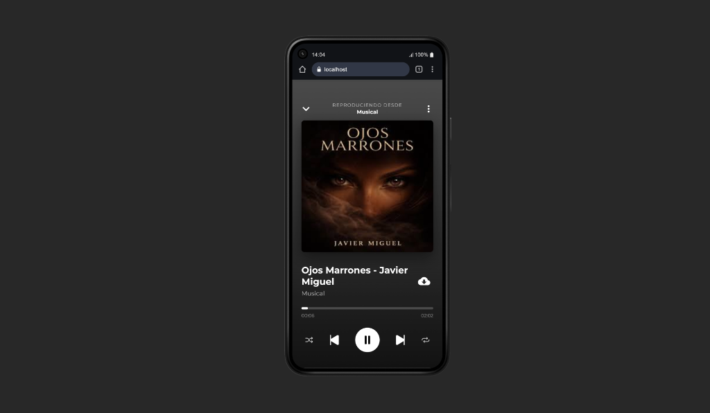

# 📻 Radio América 90.9 FM — Plataforma Digital & Multimedia

<div align="center">


**La Onda de la Alegría en la era digital.**  
Una experiencia interactiva y multiplataforma diseñada para conectar a la audiencia con la transmisión en vivo, noticias de última hora, podcasts exclusivos y contenido audiovisual de alta fidelidad.

[](https://expo.dev)
[](https://reactnative.dev)
[](https://nodejs.org)
[](https://nativewind.dev)
[](https://deepmind.google)

</div>

---

## 📱 Capturas de la Aplicación

| 📰 Noticias & En Vivo | 📖 Modo Lectura & Marcadores | 🎧 Reproductor & Descargas |
| :---: | :---: | :---: |
|  |  |  |

<div align="center">
  <sub><i>Interfaz móvil con soporte de modo oscuro, reproductor persistente y tipografía corporativa Montserrat.</i></sub>
</div>

---

## 🤖 Ingeniería & Asistencia con Inteligencia Artificial

Este ecosistema digital fue desarrollado y optimizado en colaboración con **Antigravity AI** (Google DeepMind / Gemini) como herramienta inteligente de ingeniería de software:

* **Arquitectura Resiliente:** Diseño de caché multinivel (`AsyncStorage` + memoria) para eliminar tiempos de espera y garantizar funcionamiento sin interrupciones.
* **Flujos Multimedia Avanzados:** Implementación del mini-reproductor flotante **Picture-in-Picture (PiP)** con reanudación exacta de tiempo (`currentTime`).
* **Optimización en Tiempo Real:** Algoritmos de cálculo relativo de fechas en vivo y consumo eficiente de APIs externas (WordPress REST API, Dólar API y streaming Icecast HTTPS).

---

## ✨ Características Principales

### 🔴 Transmisión Radial 24/7 en Vivo
* Streaming de audio en alta fidelidad mediante protocolo seguro **HTTPS Icecast**.
* Reproductor persistente que acompaña al usuario durante toda la navegación.
* Controles integrados en segundo plano y pantalla de bloqueo.

### 📺 Reproductor de Video & Picture-in-Picture (PiP)
* Mini-player flotante estilo **YouTube**: minimiza el video para seguir navegando por las noticias y programas mientras el contenido se sigue reproduciendo en primer plano.
* **Persistencia de sesión:** Si expandes de nuevo el video, continuará exactamente en el segundo donde lo dejaste.

### 📰 Noticias al Instante & Guardados para Leer Más Tarde
* Sincronización en tiempo real con el portal informativo de **Radio América**.
* **Modo Lectura:** Párrafos adaptativos, citas destacadas y carga ultrarrápida (0 ms) mediante caché local.
* **Marcadores (Bookmarks):** Guarda notas de interés para leerlas sin conexión a internet.
* **Compartir Nativo:** Envía notas a WhatsApp, Telegram, X o redes sociales directamente.

### 📥 Descargas Offline para Escuchar Sin Datos
* Descarga episodios de programas y podcasts al almacenamiento del teléfono.
* Pestaña dedicada de contenidos guardados para escuchar sin conexión a internet.

### 💵 Cintillo de Tasas Oficiales en Tiempo Real
* Marquee animado con la **Tasa Oficial BCV del Día** (USD y EUR) y actualización automática.
* Adaptación automática de contraste: letras rojas en modo claro y letras blancas en modo oscuro.

### 🖼️ Carrusel Comercial ("Presentado Por")
* Espacio publicitario dinámico y autogestionable desde el panel de control para patrocinantes y marcas aliadas.

---

## 🚀 Inicio Rápido

### 1. Iniciar la Aplicación Móvil
```bash
cd mobile
npm install
npx expo start
```
> *Presiona `a` para emulador Android, `w` para Web, o escanea el código QR desde la app **Expo Go** en tu teléfono móvil.*

### 2. Iniciar el Servidor Backend (API)
```bash
cd backend
npm install
npm run dev
```

### 3. Compilar el Instalador APK (Android)
El proyecto está preparado para generar compilaciones nativas en la nube con **EAS Build**:
```bash
cd mobile
npx eas build -p android --profile preview
```

---

## 🎨 Identidad & Diseño

* **Paleta de Colores:** Rojo Institucional (`#C13535`), Acentos Terracota y Superficies Oscuras OLED (`#131314`).
* **Tipografía Oficial:** Familia completa **Montserrat** de Google Fonts (Regular, Medium, SemiBold, Bold, ExtraBold, Black).
* **Motor de Estilos:** [NativeWind](https://www.nativewind.dev/) (Tailwind CSS adaptado para React Native).

---

## 📻 Sobre Radio América

**Radio América 90.9 FM** — *La Onda de la Alegría*  
Valencia, Estado Carabobo, Venezuela.  
🌐 [radioamerica.com.ve](https://radioamerica.com.ve)

---

<div align="center">
  <sub>Construido con pasión y tecnología de vanguardia para la audiencia de Radio América.</sub>
</div>
